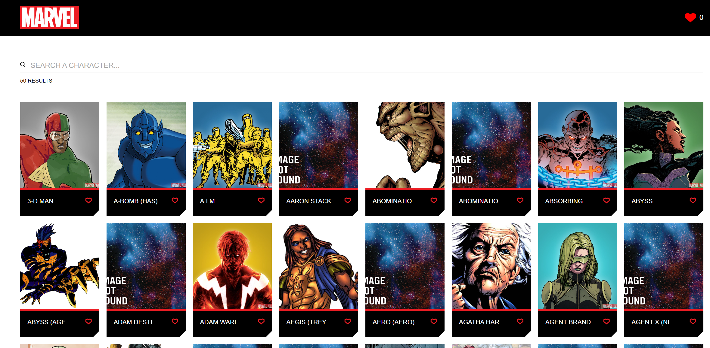
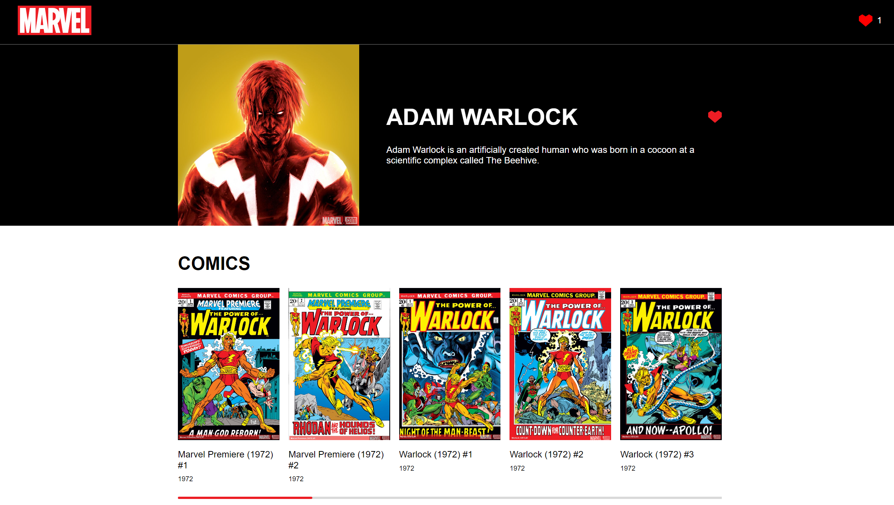
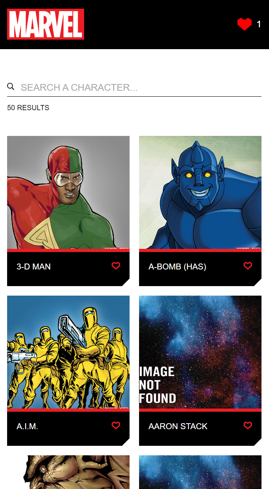

# Front-Challenge-Marvel

This project is a technical test featuring Marvel characters, consisting of two main views. The first view displays a list of 50 characters, while the second view provides details about a selected character. Additionally, the application allows users to mark characters as favorites.

## Application Views

### General View



### Character View



### Mobile View



## Technologies Used

The project is developed using the following technologies:

- **Next.js 14.2.4**: Used for server-side rendering (SSR).
- **React 18.3.1**: Main library for building the user interface.
- **TypeScript**: Language used to ensure static typing.
- **Styled Components**: Library for applying modular styles to components.

## Installation and Execution Instructions

To run the project, follow these steps:

1. Create a `.env.local` file in the project's root directory and add your personal Marvel API keys:
   ```env
   MARVEL_PUBLIC_KEY=your_public_key
   MARVEL_PRIVATE_KEY=your_private_key
   ```

2. Install the project dependencies:

   ```bash
   npm install
   ```

3. Start the development server:

   ```bash
   npm run dev
   ```

4. To run the tests, use the following command:
   ```bash
   npm run test
   ```

## Project Structure

The project is organized as follows:

```
app
├── character
│   └── [id]
│       └── page.tsx
└── components
    ├── CharacterCard
    │   ├── CharacterCard.styles.ts
    │   ├── CharacterCard.test.tsx
    │   ├── CharacterCard.tsx
    │   ├── CharacterCard.types.ts
    │   └── index.ts
    ...

contexts
├── LikesContext.tsx
lib
├── registryContext.tsx
├── registryQuery.tsx
└── registrySC.tsx
styles
├── GlobalStyles.ts
utils
├── constants.ts
├── fetchCharacter.ts
├── fetchCharacters.ts
└── fetchComics.ts
favicon.ico
head.tsx
layout.tsx
page.tsx
```

### Description of Folders and Files

- **app**: Contains the main components of the application.

  - **character/[id]**: Component for the character detail page.
  - **components**: Reusable components of the application.
    - **CharacterCard**: Component to display a character card, including its styles, tests, and types.

- **contexts**: Manages the application's context, such as `LikesContext` for handling favorite characters.

- **lib**: Contains auxiliary functionalities and registered contexts.

- **styles**: Global styles of the application.

- **utils**: Utility functions, such as `fetchCharacter.ts`, `fetchCharacters.ts`, and `fetchComics.ts` for making API calls to Marvel.

- **favicon.ico**: Application icon.

- **head.tsx**: Configuration for the Head component for SEO.

- **layout.tsx**: Main layout component of the application.

- **page.tsx**: Main page of the application.

## Deployment

The application is deployed and accessible at the following URL:
https://j-front-challenge-marvel.netlify.app
